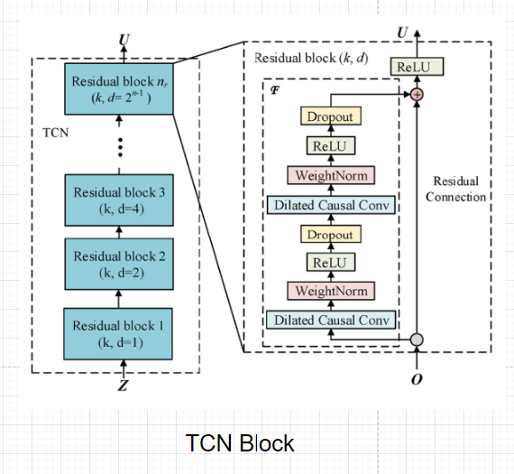

# RUL Prediction

## Task

- Using a custom developed TCN based model architecture to predict Remaining Useful Life (RUL) of turbofan engines from CMAPSS dataset 

## Data

-[CMAPSS Data](https://data.nasa.gov/Aeorspace/CMAPSS-Jet-Engine-Simulated-Data/ff5v-kuh6)

-[Challenge Data](https://data.nasa.gov/download/nk8v-ckry/application%2Fzip)

## Data Citations

- CMAPSS -  A. Saxena and K. Goebel (2008). “Turbofan Engine Degradation Simulation Data Set”, NASA Prognostics Data Repository, NASA Ames Research Center, Moffett Field, CA

- Challenge - A. Saxena and K. Goebel (2008). “PHM08 Challenge Data Set”, NASA Prognostics Data Repository, NASA Ames Research Center, Moffett Field, CA

